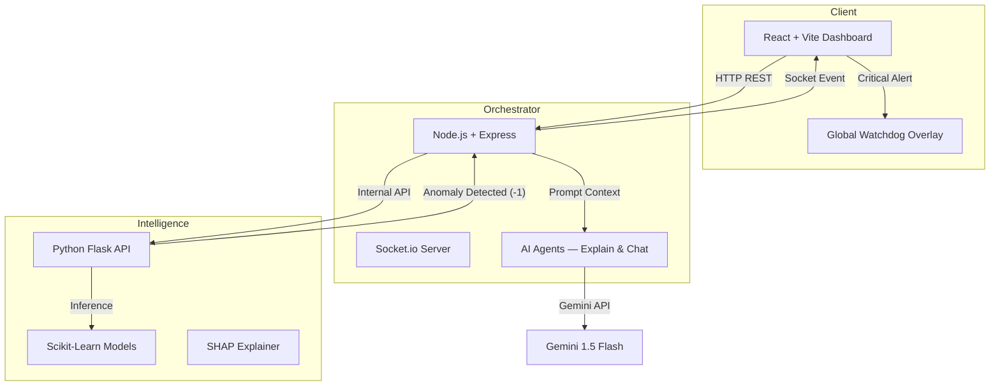

# TrustAI — The Autonomous Financial Explainability Engine

**Bridging the gap between Black-Box AI and Regulatory Trust**

TrustAI is a multi-agent autonomous system designed to make AI-driven financial decisions **transparent, secure, compliant, and user-centric**. It wraps traditional ML models with an agentic intelligence layer that explains decisions, detects fraud in real time, and provides actionable financial insights.

---

## 🚀 Key Features

### 1. Deep Explainability — *The “Why”*
- Uses **SHAP (SHapley Additive exPlanations)** to compute the mathematical impact of every feature.
- Visual output: Green/Red bar charts showing helpful vs harmful factors.
- Humanized insights powered by **Gemini 1.5 Flash**, e.g.  
  _“Your high DTI ratio is the main blocker.”_

---

### 2. Real-Time Watchdog — *The “Safety”*
- Continuous monitoring of financial activity streams.
- Powered by **Isolation Forest anomaly detection** via Python microservice.
- Event-driven WebSocket alerts for:
  - Sudden geo-location shifts
  - Velocity spikes
  - Suspicious transaction patterns
- Crisis Mode UI allowing administrators to instantly freeze accounts.

---

### 3. “What-If” Simulator — *The “Agency”*
Test financial scenarios before taking action:

> _“If I increase my income by ₹10,000, will I get approved?”_

Models re-run inference **without modifying the user's permanent record**.

---

### 4. Context-Aware Financial Chat Assistant
Not a generic chatbot—an intelligent companion.

- Accesses user's financial identity
- Understands portfolio positions  
  _“How is my Reliance stock doing?”_
- Calculates affordability, EMI capacity, spending stress, etc.

---

## 🏗️ System Architecture



---

## Tech Stack

| Layer | Technology | Usage |
|-------|-------------|-------|
| Frontend | React 18, TypeScript, Vite | Enterprise-grade UI |
| Styling | Tailwind + Shadcn/UI | Modular design system |
| Backend | Node.js, Express | API Gateway, Agent Orchestration |
| Real-Time | Socket.io | Bi-directional security alerts |
| ML Engine | Python, Flask | Risk scoring & anomaly detection |
| AI Logic | Google Gemini 1.5 Flash | Natural-language reasoning |
| Libraries | Scikit-learn, SHAP, Pandas | Explainability & data prep |

---

## 🛠️ Installation & Setup

### Prerequisites
- Node.js **v16+**
- Python **v3.9+**
- Gemini API Key *(optional — mock mode available)*

---

### 1️⃣ Start the ML Microservice (The Brain)

```bash
cd backend/models

python -m venv venv
source venv/bin/activate   # or venv\Scripts\activate on Windows

pip install flask pandas scikit-learn shap joblib requests

python server.py
# 🚀 Python Server Listening on 8000...
```

---

### 2️⃣ Start the Backend (The Orchestrator)

```bash
cd backend
npm install
node server.js
# 🚀 Backend running on 5000 with Memory DB
```

---

### 3️⃣ Start the Frontend (The Interface)

```bash
cd frontend
npm install
npm run dev
# Visit http://localhost:5173
```

---

## Demo Walkthrough

**What-If Simulator**
1. Navigate to `/simulator`
2. Adjust salary slider to ₹80,000
3. Click **Run AI Prediction**
4. Observe probability update + reasoning

 **Explainability**
- Open Dashboard → click decision card
- View SHAP contribution chart
- Read human-generated advice

 **Cyber Attack Simulation**
- Click **SIMULATE ATTACK**
- Red critical alert appears instantly

**Contextual Chat**
- Ask:  
  _“Can I afford a monthly EMI of ₹20,000?”_

---

## 📂 Project Structure

```
trustai/
├── frontend/                 # React + Vite Application
│   ├── src/
│   │   ├── components/       # Alerts, Cards, Chat
│   │   ├── pages/            # Dashboard, Simulator, Profile
│   │   └── lib/              # API connectors
│
├── backend/                  # Node.js Express Application
│   ├── agents/               # ExplainAgent, ChatAgent
│   ├── routes/               # API Endpoints
│   ├── llm/                  # Gemini integration
│   └── server.js             # Entry + Socket.io
│
└── models/                   # Python ML Microservice
    ├── train/                # Serialized ML models (.pkl)
    └── server.py             # Inference API
```

---

## Future Roadmap

- [ ] Vector DB (RAG) → Upload PDF bank statements
- [ ] Blockchain Audit Trail for regulatory compliance
- [ ] Voice Agent for accessibility
- [ ] Multi-institution fraud graph
- [ ] Self-optimizing hyperparameter agent

---

## 📄 License
MIT License — free for personal & commercial use

---

## 👥 Authors
**TrustAI Team**
